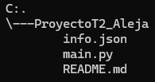

# Plataforma de Gestión
Realización de maquetación de un menú.

# Descripción
Se realizó una plataforma con un menú donde se podrán añadir, modificar, eliminar estudiantes y actualizar la información que ya se tienen de los estudiantes.

# Tecnologías utilizadas

- PYTHON
- JSON

# Estructura del proyecto

# Características

| Nombre | Descripción |
|--|--|
|Archivo [main.py]|Contiene el código
|Archivo [info.json]|Contiene la información utilizada en el código|
|Archivo [README.md]|Contiene la explicación e información del proyecto|

# Desarrollado por

El proyecto fue realizado por Alejandra Machuca, estudiante de CampusLands como trabajo en clase.